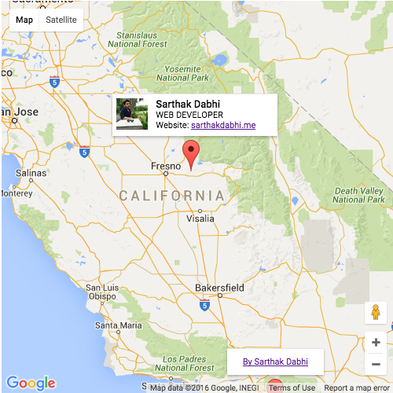

# infopopup
Infowindow: A JavaScript plugin, Google do not provide fancy an Infowindow, an alternative of an Infowindow.

Easy to modified. Put your HTML template and enjoy fancy infopopup on Google map.

##### Used by Wwhere startup [Wwhere](https://wwhere.is)

##### Sample


##### Code:
```javascript
var options = {
  'className': 'info-pop-up-content',
  'background': '#FFFFFF',
  'padding': '5px',
  'minWidth': '200', //px
  'content': '<div class="tile"><div class="width-30"></div><div class="width-70"><label>Sarthak Dabhi</label><br>WEB DEVELOPER<br>Website: <a href="http://sarthakdabhi.me/">sarthakdabhi.me</a></div></div>'
};
var infoPopup = new InfoPopup(marker, map, options);
```

> For more information email me at dabhi.sarthak@gmail.com

> Website: [sarthakdabhi.me](http://sarthakdabhi.me) 

> LinkedIn: [https://www.linkedin.com/in/sarthakdabhi](https://www.linkedin.com/in/sarthakdabhi)

> Twitter: [@SarthakDabhi](https://twitter.com/SarthakDabhi)
